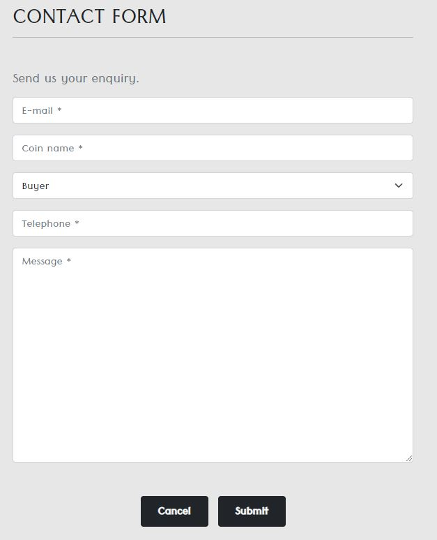
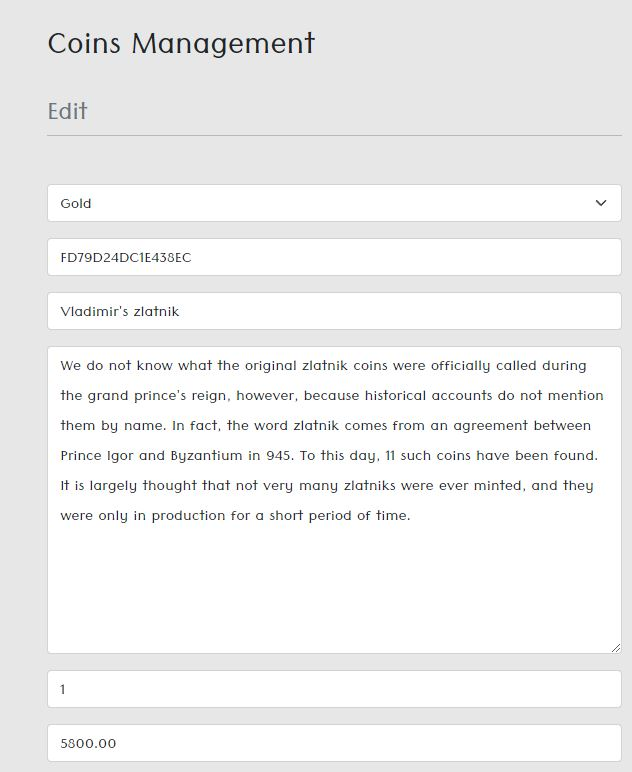
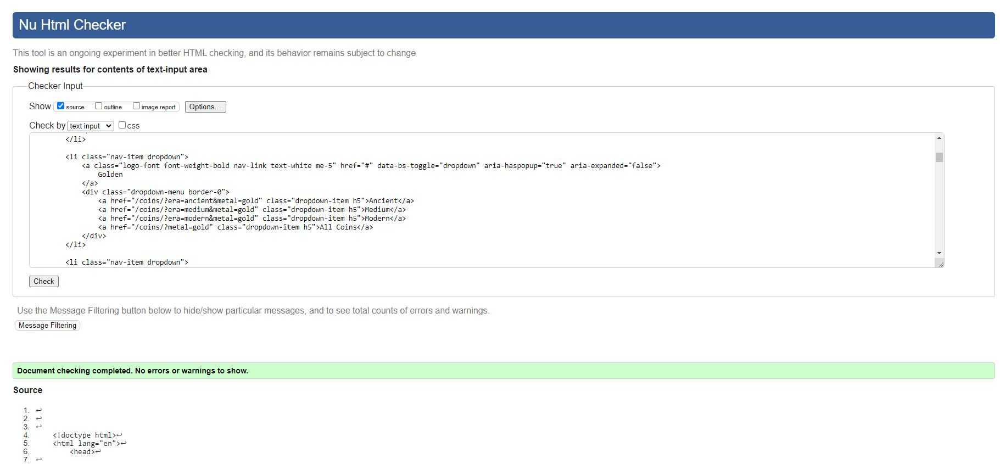
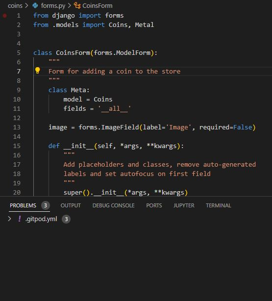
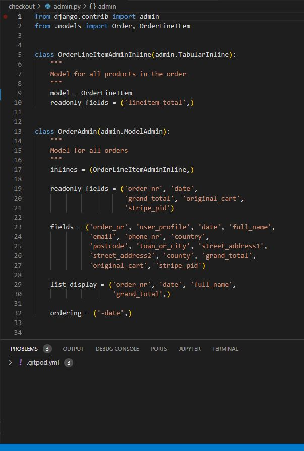

# Golden Coin

**Developer: Igor Vasiljev**

[Link to the live project](https://goldencoin.herokuapp.com/)

## About

The app represents a store which offers to buy coins of different makes, substantially made from gold, silver and bronze. There is also form for sending offers to sell coins.
Admin privileges include adding, removing and modifying coins data.

## Table of Contents

  - [Project Goals](#project-goals)
    - [User Goals](#user-goals)
    - [Site Owner Goals](#site-owner-goals)
  - [User Experience](#user-experience)
    - [Target Audience](#target-audience)
    - [User Requirements and Expectations](#user-requirements-and-expectations)
  - [User Stories](#user-stories)
    - [Users](#users)
    - [Site Owner](#site-owner)
  - [Technical Design](#technical-design)
    - [Structure](#structure)
    - [Database](#database)
  - [Technologies Used](#technologies-used)
    - [Languages](#languages)
    - [Frameworks](#frameworks)
    - [Libraries and Tools](#libraries-and-tools)
  - [Features](#features)
  - [Validation](#validation)
  - [Testing](#testing)
    - [Manual Testing](#manual-testing)
    - [Automated Testing](#automated-testing)
  - [Bugs](#bugs)
  - [Deployment](#deployment)
  - [Credits](#credits)

## Project Goals

### User Goals

- Ability to buy coins when authorized or anonymously.
- Save and update profile data.
- Access order history.
- Offer coins to sell.
- Use the contact form.
- Subscribe for mailing list.

### Site Owner Goals

- To be able to keep track of all orders.
- Add/remove or modify coins data.
- Track offers to sell coins.
- Track contact form enquiries.
- Retain clients by using mailing system.

## User Experience

### Target Audience

- Those who are interested in numismatics.
- Who is looking to sell their coins.
- Who is looking for making investement in precious metals.

### User Requirements and Expectations

- Intuitive navigation.
- Responsive design.
- Exhaustive information about the store items.
- Easy way to add/remove items from cart and checkout.
- Checkout anonymously.
- Access information to previous orders.

## User Stories

### Users

1. As a user I can access the home page so that general site information and navigation can be viewed.
2. As a user I can use navigation links and search bar so that site pages and search results can be viewed.
3. As a user I can view the footer so that social media and contact forms can be accessed
4. As a user I can access all coins link so that all available coins can be viewed.
5. As a user I can use filter coins so that different categories of coins can be grouped on the same view.
6. As a user I can view coins as badges on the coins page so that all relevant each coin's information and price can be viewed.
7. As a user I can preview each coin so that coins's information can be viewed
8. As a user I can use coin ordering so that coins can be sorted by price, origin, condition, name and era.
9. As a user I can open the cart so that cart contents can be viewed and modified.
10. As a user I can add coins to cart so that coins are added to cart and overall price is visible.
11. As a user I can access the checkout page so that delivery and payment information can be entered to process the purchase.
12. As a user I can complete the order so that order is confirmed and order number is available.
13. As a user I can access the coin sell form so that the form can be populated with the coin offer.
14. As a user I can submit the contact form so that site owners can be contacted.
15. As a user I can access profile page so that delivery information can be added/amended and order history can be viewed.
16. As a user I can access Sign Up menu so that it's possible to create an account.
17. As a user I can access the login menu so that it's possible to log in to the site.

### Site Owner

18. As a admin I can access coins management so that new coins can be added to the store.
19. As a admin I can access coin edit page so that coin information can be modified or deleted.

[Back to Table Of Contents](#table-of-contents)

## Technical Design

### Structure

The app has the following structure: navigation bar on top, footer on bottom - visible across all app pages, and the content/functionality are in between.

Common app's pages:
- Home: logo and link to explore the store items.
- Coins: list of all coins available in the store with relevant information.
- Coin details: detailed coin information and add to cart button.
- Cart: coins added to cart, price and delivery information.
- Checkout: checkout form, items information and total price.
- Checkout success: summary of order with the tracking number.
- My Profile: delivery information form and order history.
- Order history: information about the item ordered in past.
- Sell coins: form to offer coins to sell.
- Contact: contact form.
- Sign Up: sign up input fields.
- Pages 400, 403, 404, 500

Admin only pages:
- Edit coin: coin information with ability to modify it.
- Coins Management: form to add a new coin to the store.

### Database

- Database consists of 8 models - UserProfile, User, Coins, Metal, Order, OrderLineItem, Sell and Contact.
- PostgreSQL is used as a database management system.
- Models were built using Django framework.

Database

### UserProfile model
This model contains:
- User
- Default phone number
- Default street address 1
- Default street address 2
- Default town or city
- Default county
- Default postcode
- Default country

### User model
Contains user-related data: 
- Username
- Password
- First Name
- Last Name
- Email
- Is Active?
- Is Staff?
- Is Superuser?
- Last login
- Date joined

### Coins model
The model contains:
- Metal
- SKU
- Name
- Description
- Quantity
- Price
- Origin
- Year
- Condition
- Era
- Image URL
- Image

### Metal model
The model contains:
- Name
- Friendly name

### Order model
The model contains:
- Order number
- UserProfile
- Full Name
- Email
- Phone Number
- Country
- Postcode
- Town or City
- Street Address 1
- Street Address 2
- County
- Date
- Grand Total
- Original Cart
- Stripe PID

### OrderLineItem model
The model contains:
- Order
- Coins
- Coin Quantity
- Lineitem Total

### Sell model
The model contains:
- Email
- Coin Name
- Description
- Metal
- Origin
- Condition
- Ask Price
- Negotiable?
- Image

### Contact model
The model contains:
- Email
- Name
- Buyer or Seller
- Phone Number
- Message

## Technologies Used

### Languages

- HTML
- CSS
- JavaScript
- Python

### Frameworks

- Django

### Libraries and Tools
- [Bootstrap 5.1](https://getbootstrap.com/) was used to style UI components
- [Amazon AWS](https://aws.amazon.com/) as static and media files management system
- [Quick DBD](https://www.quickdatabasediagrams.com/) as database diagram design tool
- [Font Awesome](https://fontawesome.com/) as a toolkit for icons
- [GitHub](https://github.com/) as a repository for the project code
- [Heroku](https://www.heroku.com/) to deploy the project
- [jQuery](https://jquery.com/) as a JS library was used to manipulate the DOM
- [ElephantSQL](https://www.elephantsql.com/) as a database management system
- [writer.com](https://writer.com/grammar-checker/) as spelling check tool
- [Stripe](https://stripe.com/grammar-checker/) as embedded payment system
- [xml-sitemaps.com](https://www.xml-sitemaps.com/) as sitemap.xml page generator
- [Mailchimp](https://mailchimp.com/) as mailing management tool

### Python Libraries

- [os](https://docs.python.org/3/library/os.html) as mapping object to represent environmental variables
- [allauth](https://django-allauth.readthedocs.io/en/latest/) for user authentication
- [unittest](https://docs.djangoproject.com/en/4.1/topics/testing/overview/) as unit test module

## Features

### Navigation bar

- Navbar takes a fixed position at the top of the screen and is available across all pages of the app.
- Search bar is taking center position within the navbar.
- Logo is located on the left and contain home page link.
- Links to filtered store items are located under the search bar.
- Links include: All coins, Golden, Silver, Bronze.
- My Account menu is on the right of navbar and contain coin management(for admin only), SignUp/Login and My Profile.
- Cart is also on the right of navbar.
- Covered by user stories 1, 2, 4, 9, 15-18

Show Navbar screenshot

### Home page

- Home page contains the following sections:
  - General information
  - Explore button leading to all coins page
- Covered by user story 1

Show Home page screenshot

### Footer

- Footer is fixed on the bottom and available across all pages of the app.
- Link to social media are available in the footer.
- Contact form is available in the footer.
- Sell coins form is available in the footer.
- Subscribe to mailing list is located in the footer.
- Covered by user story 3

Show Footer screenshot

### Coins

- Coins page contain all coins that are available in the store.
- Coins page is accessible from the navbar and home page.
- The following coin categories are available:
    - Gold
    - Silver
    - Bronze
- Sorting available for coins on navbar:
    - By Price
    - By Origin
    - By Condition
    - All Coins
- Sorting available on Coins page:
    - Price (low to high)
    - Price (high to low)
    - Name (A-Z)
    - Name (Z-A)
    - Era (Ancient-Modern)
    - Era (Modern-Ancient)
- Filters available for each coin category:
    - Ancient
    - Medium
    - Modern
    - All Coins
- Tags are available for each category (Gold, Silver, Bronze)
- Edit/Delete menu is visible only for admin users.
- Covered by user stories 4-6, 8, 19

Show Coins screenshot

Show Search results screenshot

Show Tags screenshot

### Coin details

- Coin details page contain the following information: name, price, metal, condition, origin, year.
- Add to cart button is located on coin details page.
- Category tag is showing on the page.
- Increment/Decrement menu is displayed (for multiple coins) and 'Unique' mark if the coin quantity in store is 1.
- Edit/Delete menu is visible only for admin users.
- Covered by user stories 7, 10, 19

Show Coin Details screenshot

Show Non Unique coin screenshot

### Cart

- Cart page is accessible from the navbar.
- Coins summary can be seen on the cart page: coins info, price, quantuty, delivery fee, subtotal and grand total.
- Coins amount can be adjusted or removed; if the coin is unique then it can be only removed.
- Covered by user stories 9, 10

Show Cart screenshot

Show Add to Cart screenshot

Show Multiple coins in Cart screenshot

### Checkout

- Checkout page is accessible from the cart.
- Order summary can be seen on the page.
- Delivery form is available on the page.
- Form information can be saved to the Profile if the user is logged in.
- Payment form is available on the page.
- Covered by user story 11

Show Checkout screenshot

Show Invalid Card Details screenshot

Show Order Processing screenshot

### Checkout Success

- Checkout Success page is rendered if the checkout was successful.
- Order number, date, delivery address and billing information can be seen on the page.
- Delivery information is displayed on the page.
- Email address where the confirmation was sent is displayed on the page.
- Covered by user story 12

Show Checkout Success screenshot

### Sell

- Sell coins form can be accessed from the footer.
- Sell form is displayed on the page.
- Covered by user story 13

Show Sell screenshot

### Contact

- Contact form can be accessed from the footer.
- Contact form is displayed on the page.
- Covered by user story 14

Show Contact screenshot

### User Profile

- User profile form can be accessed from the My Account menu in nav bar.
- The form is available only for authorized users.
- It's possible to save the user profile form on Checkout page.
- User profile form can be updated.
- Order history is available on the page.
- Covered by user stories 11, 15

Show User Profile screenshot

### Order History

- Order History link is located on My Profile page.
- The page is available only to for authorized users.
- The order history is displayed only when profile has successful orders in the past.
- Order number, date, delivery address and billing information can be seen on the page.
- Delivery information is displayed on the page.
- Email address where the confirmation was sent is displayed on the page.
- Covered by user stories 12, 15

Show Order History screenshot

### Coin Management

- Coin Management is accessible from My Account menu on the navbar.
- The section is available only for admin users.
- Add coin form is available on the page.
- Once the form is successfully submitted the item appears on coins page.
- Covered by user story 18

Show Coin Management History screenshot

### Edit Coins

- Coins can be edited from coins and coin details pages.
- The menu available only for admin users.
- Coin data can be modified in the form.
- Covered by user story 19

Show Edit Coins History screenshot

### Sign Up

- Sign Up is located in My Account menu on navbar and is available only when not logged in.
- It's possible to create a new user.
- The following fields are displayed on the form:
  - Username
  - E-mail (optional)
  - Password (twice)
- If username is not available, the invalidation message is displayed.
- Covered by user story 16

Show Sign Up screenshot

Show Username already exists screenshot

### Login

- Login is located in My Account menu on navbar and is available only when not logged in.
- It's possible to authorize into the system using a created login and password.
- The following fields are displayed on the form:
  - Username
  - Password
- If username/password are incorrect, the invalidation message is displayed.
- 'Remember me' checkbox is available.
- Once logged in the user is redirected to home page.
- Covered by user story 17

Show Login screenshot

Show Login error screenshot

### Logout

- Logout is located in My Account menu on navbar and available only when logged in.
- Once logged out the user is redirected to home page.
- Covered by user story 17

Show Logout screenshot

### Forgot Password

- Forgor Password link is accessible from login page.
- Email address input is shown on the form.
- Once submitted the email is generated to restore the password.
- Covered by user story 17

Show Forgot Password screenshot

## Validation

### HTML validation

[W3C Markup Validation Service](https://validator.w3.org/) was used to validate HTML content of all app's pages.

Home

Coins

Coin Details

Cart

Checkout

Checkout Success

Order History

Sell

Contact

Coin Management

Edit Coin

My Profile

Sign Up

Login

404

### CSS validation

[W3C CSS Validation Service](https://jigsaw.w3.org/css-validator/) was used to validate Style.css file.

base.css

checkout.css

### JS validation

[JSHint](https://jshint.com/) was used to validate Script.js file.

Incredemt/decrement menu

Cart

Stripe

Toasts

### Python validation

[pycodstyle](https://pypi.org/project/pycodestyle/) extension was used to validate Python code.

Home

  

urls.py

  

  

  

views.py

  

  

Coins

  

admin.py

  

  

  

forms.py

  

  

  

models.py

  

  

  

urls.py

  

  

  

views.py

  

  

Cart

  

contexts.py

  

  

  

urls.py

  

  

  

views.py

  

  

Checkout

  

admin.py

  

  

  

forms.py

  

  

  

models.py

  

  

  

signals.py

  

  

  

urls.py

  

  

  

views.py

  

  

  

webhooks_handler.py

  

  

  

webhooks.py

  

  

My Profile

  

forms.py

  

  

  

models.py

  

  

  

urls.py

  

  

  

views.py

  

  

Sell

  

admin.py

  

  

  

forms.py

  

  

  

models.py

  

  

  

urls.py

  

  

  

views.py

  

  

Contact

  

admin.py

  

  

  

forms.py

  

  

  

models.py

  

  

  

urls.py

  

  

  

views.py

  

  

[Back to Table Of Contents](#table-of-contents)

The project was tested using 2 methods:
- Manual
- Automated testing

### Manual Testing

User stories testing

1. As a user I can access the home page so that general site information and navigation can be viewed.

| **Feature**   | **Action**                    | **Expected Result**          | **Actual Result** |
| ------------- | ----------------------------- | ---------------------------- | ----------------- |
| Home page | Load the page | Images and content are correctly aligned | Works as expected |
| Home page | Click 'Explore' button | Coins page is rendered | Works as expected |
| Home page | Change resolution from 1600px to 320px | Elements are correctly aligned | Works as expected |

  

Screenshot

  

  

  

Screenshot

  

  

2. As a user I can use navigation links and search bar so that site pages and search results can be viewed.

  | **Feature**   | **Action**                    | **Expected Result**          | **Actual Result** |
| ------------- | ----------------------------- | ---------------------------- | ----------------- |
| Navbar | Click app's logo | Navigated to home page | Works as expected |
| Navbar | Enter query into search bar and click search button | Navigated to 'Coins' page with the results properly filtered | Works as expected |
| Navbar | Click 'All Coins' -> 'By Price' | Navigated to 'Coins' page with coins sorted by price (high to low) | Works as expected |
| Navbar | Click 'All Coins' -> 'By Origin' | Navigated to 'Coins' page with coins sorted by origin (alphabetic order A-Z) | Works as expected |
| Navbar | Click 'All Coins' -> 'By Condition' | Navigated to 'Coins' page with coins sorted by condition (uncirculated - fair) | Works as expected |
| Navbar | Click 'All Coins' -> 'All Coins' | Navigated to 'Coins' page with all coins displayed | Works as expected |
| Navbar | Click 'Golden' -> 'Ancient' | Navigated to 'Coins' page with filtered results by metal(gold) and era(ancient) | Works as expected |
| Navbar | Click 'Golden' -> 'Medium' | Navigated to 'Coins' page with filtered results by metal(gold) and era(medium) | Works as expected |
| Navbar | Click 'Golden' -> 'Modern' | Navigated to 'Coins' page with filtered results by metal(gold) and era(modern) | Works as expected |
| Navbar | Click 'Golden' -> 'All Coins' | Navigated to 'Coins' page with filtered results by metal(gold) | Works as expected |
| Navbar | Click 'Silver' -> 'Ancient' | Navigated to 'Coins' page with filtered results by metal(silver) and era(ancient) | Works as expected |
| Navbar | Click 'Silver' -> 'Medium' | Navigated to 'Coins' page with filtered results by metal(silver) and era(medium) | Works as expected |
| Navbar | Click 'Silver' -> 'Modern' | Navigated to 'Coins' page with filtered results by metal(silver) and era(modern) | Works as expected |
| Navbar | Click 'Silver' -> 'All Coins' | Navigated to 'Coins' page with filtered results by metal(gold) | Works as expected |
| Navbar | Click 'Bronze' -> 'Ancient' | Navigated to 'Coins' page with filtered results by metal(bronze) and era(ancient) | Works as expected |
| Navbar | Click 'Bronze' -> 'Medium' | Navigated to 'Coins' page with filtered results by metal(bronze) and era(medium) | Works as expected |
| Navbar | Click 'Bronze' -> 'Modern' | Navigated to 'Coins' page with filtered results by metal(bronze) and era(modern) | Works as expected |
| Navbar | Click 'Bronze' -> 'All Coins' | Navigated to 'Coins' page with filtered results by metal(bronze) and era(modern) | Works as expected |
| Navbar | Click 'My Account' -> 'Coins Management' | Navigated to 'Coins Management' page | Works as expected |
| Navbar | Click 'My Account' -> 'My Profile' | Navigated to 'My Profile' page | Works as expected |
| Navbar | Click 'My Account' -> 'Register' | Navigated to 'Sign Up' page | Works as expected |
| Navbar | Click 'My Account' -> 'Login'  | Navigated to 'Login' page | Works as expected |
| Navbar | Click 'My Account' -> 'Logout' | Navigated to 'Logout' page | Works as expected |
| Navbar | Click $ Total | Navigated to 'Cart' page | Works as expected |

  

Screenshot

  

  

  

Screenshot

  

  

  

Screenshot

  

  

  

Screenshot

  

  

  

Screenshot

  

  

3. As a user I can view the footer so that social media and contact forms can be accessed

  | **Feature**   | **Action**                    | **Expected Result**          | **Actual Result** |
| ------------- | ----------------------------- | ---------------------------- | ----------------- |
| Footer | Navigate through different pages of the app | Footer links are displayed on all pages of the app | Works as expected |
| Footer | Click social media link icon | Correct page is opening in separate tab | Works as expected |
| Footer | Click 'Contact' | Navigated to 'Contact' page | Works as expected |
| Footer | Click 'Sell' | Navigated to 'Sell' page | Works as expected |
| Footer | Click 'Subscribe' | Subscribe menu popped up | Works as expected |
| Footer | Hover onto footer icons | Styling correctly changes on hover | Works as expected |

  

Screenshot

  

  

  

Screenshot

  

  

4. As a user I can access all coins link so that all available coins can be viewed.

  | **Feature**   | **Action**                    | **Expected Result**          | **Actual Result** |
| ------------- | ----------------------------- | ---------------------------- | ----------------- |
| Coins | Navigate to Coins page | All coins available in the store are displayed | Works as expected |
| Coins | Navigate to Coins page | Coins amount is displayed and correct | Works as expected |
| Coins | Sort the page by price (low to high) | Coins sorted on the page by price low to high | Works as expected |
| Coins | Sort the page by price (high to low) | Coins sorted on the page by price high to low | Works as expected |
| Coins | Sort the page by name (A-Z) | Coins sorted on the page by name A-Z | Works as expected |
| Coins | Sort the page by name (Z-A) | Coins sorted on the page by name Z-A | Works as expected |
| Coins | Sort the page by era (ancient-modern) | Coins sorted on the page by era ancient-modern | Works as expected |
| Coins | Sort the page by era (modern-ancient) | Coins sorted on the page by era modern-ancient | Works as expected |
| Coins | Click on 'Gold' tag | Only coins with 'Gold' tag are displayed on the page | Works as expected |
| Coins | Click on 'Silver' tag | Only coins with 'Silver' tag are displayed on the page | Works as expected |
| Coins | Click on 'Bronze' tag | Only coins with 'Bronze' tag are displayed on the page | Works as expected |
| Coins | Enter 'revolution' into search bar | Only coins containing 'revolution' in description are displayed | Works as expected |
| Coins | Click 'Coins Home' | All available in the store coins are displayed | Works as expected |
| Coins | Click 'Edit' on any coin (admin only) | Navigated to edit page with the correct coin id | Works as expected |
| Coins | Click 'Delete' on any coin (admin only) | Coin is no longer displayed in the store | Works as expected |
| Coins | Scroll down to the bottom and click auto scroll up icon | Navigated to the top of the page | Works as expected |

  

Screenshot

  

  

  

Screenshot

  

  

  

Screenshot

  

  

  5. As a user I can use filter coins so that different categories of coins can be grouped on the same view.

  | **Feature**   | **Action**                    | **Expected Result**          | **Actual Result** |
| ------------- | ----------------------------- | ---------------------------- | ----------------- |
| Filter | Click 'All Coins' -> 'By Price' | Navigated to 'Coins' page with coins sorted by price (high to low) | Works as expected |
| Filter | Click 'All Coins' -> 'By Origin' | Navigated to 'Coins' page with coins sorted by origin (alphabetic order A-Z) | Works as expected |
| Filter | Click 'All Coins' -> 'By Condition' | Navigated to 'Coins' page with coins sorted by condition (uncirculated - fair) | Works as expected |
| Filter | Click 'All Coins' -> 'All Coins' | Navigated to 'Coins' page with all coins displayed | Works as expected |
| Filter | Click 'Golden' -> 'Ancient' | Navigated to 'Coins' page with filtered results by metal(gold) and era(ancient) | Works as expected |
| Filter | Click 'Golden' -> 'Medium' | Navigated to 'Coins' page with filtered results by metal(gold) and era(medium) | Works as expected |
| Filter | Click 'Golden' -> 'Modern' | Navigated to 'Coins' page with filtered results by metal(gold) and era(modern) | Works as expected |
| Filter | Click 'Golden' -> 'All Coins' | Navigated to 'Coins' page with filtered results by metal(gold) | Works as expected |
| Filter | Click 'Silver' -> 'Ancient' | Navigated to 'Coins' page with filtered results by metal(silver) and era(ancient) | Works as expected |
| Filter | Click 'Silver' -> 'Medium' | Navigated to 'Coins' page with filtered results by metal(silver) and era(medium) | Works as expected |
| Filter | Click 'Silver' -> 'Modern' | Navigated to 'Coins' page with filtered results by metal(silver) and era(modern) | Works as expected |
| Filter | Click 'Silver' -> 'All Coins' | Navigated to 'Coins' page with filtered results by metal(gold) | Works as expected |
| Filter | Click 'Bronze' -> 'Ancient' | Navigated to 'Coins' page with filtered results by metal(bronze) and era(ancient) | Works as expected |
| Filter | Click 'Bronze' -> 'Medium' | Navigated to 'Coins' page with filtered results by metal(bronze) and era(medium) | Works as expected |
| Filter | Click 'Bronze' -> 'Modern' | Navigated to 'Coins' page with filtered results by metal(bronze) and era(modern) | Works as expected |
| Filter | Click 'Bronze' -> 'All Coins' | Navigated to 'Coins' page with filtered results by metal(bronze) and era(modern) | Works as expected |

  

Screenshot

  

  

6. As a user I can view coins as badges on the coins page so that all relevant each coin's information and price can be viewed.

  | **Feature**   | **Action**                    | **Expected Result**          | **Actual Result** |
| ------------- | ----------------------------- | ---------------------------- | ----------------- |
| Badges | Navigate to Coins page | All coins are displayed as badges | Works as expected |
| Badges | Navigate to Coins page | Coin image, name, metal, condition, origin, year, tag and price are displayed and correctly aligned | Works as expected |
| Badges | Navigate to Coins page (admin only) | Edit/Delete menu is displayed on each coin | Works as expected |

  

Screenshot

  

  

7. As a user I can preview each coin so that coins's information can be viewed

  | **Feature**   | **Action**                    | **Expected Result**          | **Actual Result** |
| ------------- | ----------------------------- | ---------------------------- | ----------------- |
| Coin details | Click on coin badge on the Coins page | Navigated to the coin details page | Works as expected |
| Coin details | Navigate to coin details page | Coin image, name, metal, condition, origin, year, tag, price and description are displayed and correctly aligned | Works as expected |
| Coin details | Navigate to coin details page | Add to cart button is displayed | Works as expected |
| Coin details | Navigate to unique coin details page | 'Unique' mark is displayed and there is no menu to increment/decrement coin amount | Works as expected |
| Coin details | Navigate to non-unique coin details page | 'Unique' mark is not displayed and there is menu to increment/decrement coin amount | Works as expected |
| Coin details | Navigate to coin details page | 'Keep exploring' button is displayed and leading to Coins page once clicked | Works as expected |
| Coin details | Click coin tag | Navigated to Coins page with correctly filtered results | Works as expected |
| Coin details | Navigate to coin details page (admin only) | Edit/Delete menu is displayed | Works as expected |

  

Screenshot

  

  

  

Screenshot

  

  

8. As a user I can use coin ordering so that coins can be sorted by price, origin, condition, name and era.

  | **Feature**   | **Action**                    | **Expected Result**          | **Actual Result** |
| ------------- | ----------------------------- | ---------------------------- | ----------------- |
| Ordering | Sort the page by price (low to high) | Coins sorted on the page by price low to high | Works as expected |
| Ordering | Sort the page by price (high to low) | Coins sorted on the page by price high to low | Works as expected |
| Ordering | Sort the page by name (A-Z) | Coins sorted on the page by name A-Z | Works as expected |
| Ordering | Sort the page by name (Z-A) | Coins sorted on the page by name Z-A | Works as expected |
| Ordering | Sort the page by era (ancient-modern) | Coins sorted on the page by era ancient-modern | Works as expected |
| Ordering | Sort the page by era (modern-ancient) | Coins sorted on the page by era modern-ancient | Works as expected |

  

Screenshot

  

  

9. As a user I can open the cart so that cart contents can be viewed and modified.

  | **Feature**   | **Action**                    | **Expected Result**          | **Actual Result** |
| ------------- | ----------------------------- | ---------------------------- | ----------------- |
| Cart | Navigate to empty cart | No coins are displayed and 'Keep exploring' button is showing | Works as expected |
| Cart | Navigate to cart with coins in it | Coin image, name, SKU, quantity, cart total, subtotal, delivery fee and grand total are displayed and correctly aligned | Works as expected |
| Cart | Navigate to cart with unique coins | Amount of unique coins can't be incremented | Works as expected |
| Cart | Navigate to cart with non-unique coins | Amount of unique coins can be incremented, subtotal, total and grand prices are updating correctly, correct success message is displayed | Works as expected |
| Cart | Remove coins from cart | Coins are no longer displayed in the cart, prices are updating correctly and correct success message is displayed | Works as expected |

  

Screenshot

  

  

  

Screenshot

  

  

10. As a user I can add coins to cart so that coins are added to cart and overall price is visible.

  | **Feature**   | **Action**                    | **Expected Result**          | **Actual Result** |
| ------------- | ----------------------------- | ---------------------------- | ----------------- |
| Add to Cart | Click 'Add to Cart' on the coin details page | Coin is added to cart and correct success message is displayed | Works as expected |
| Add to Cart | Click 'Add to Cart' on the unique coin details page | Only 1 coin is added to cart and correct success message is displayed | Works as expected |
| Add to Cart | Click 'Add to Cart' on the unique coin which already is in the cart | Unique coins amount is not changed and the correct info message is displayed | Works as expected |
| Add to Cart | Increment coins amount and click 'Add to Cart' on the non-unique coin details page | Correct amount of coins is added to the cart, total price updated correctly | Works as expected |

  

Screenshot

  

  

  

Screenshot

  

  

11. As a user I can access the checkout page so that delivery and payment information can be entered to process the purchase.

  | **Feature**   | **Action**                    | **Expected Result**          | **Actual Result** |
| ------------- | ----------------------------- | ---------------------------- | ----------------- |
| Checkout | Click 'Secure Checkout' on the cart page | Navigated to checkout page | Works as expected |
| Checkout | Navigate to empty cart page | 'Secure Checkout' button is not displayed | Works as expected |
| Checkout | Navigate to Checkout page | All delivery form fields are displayed | Works as expected |
| Checkout | Click 'Complete Order' without filling mandatory fields | Invalidation error is shown and the order is not processed | Works as expected |
| Checkout | Navigate to Checkout page when not logged in | Form fields are displayed; there is a message suggesting to login or register  | Works as expected |
| Checkout | Navigate to Checkout page when logged in | There is a tick box to save the delivery information | Works as expected |
| Checkout | Navigate to Checkout page when logged in and there is saved profile information | Fields are pre-populated with the saved delivery information | Works as expected |
| Checkout | Process the checkout when logged in and without saving the delivery information | Delivery information is not saved to profile | Works as expected |
| Checkout | Navigate to Checkout page | Order summary is displayed; subtotal, total price, delivery and grand total are displayed | Works as expected |
| Checkout | Fill invalid payment details to the payment form | Invalidation error is correctly shown | Works as expected |
| Checkout | Fill valid payment details and click 'Complete Order' | Loading screen is shown; 'Complete Order' button and payment form are not available | Works as expected |
| Checkout | Navigate to Checkout page | 'Adjust Cart' button is displayed and leading to the cart page | Works as expected |

  

Screenshot

  

  

  

Screenshot

  

  

  

Screenshot

  

  

  

Screenshot

  

  

12. As a user I can complete the order so that order is confirmed and order number is available.

  | **Feature**   | **Action**                    | **Expected Result**          | **Actual Result** |
| ------------- | ----------------------------- | ---------------------------- | ----------------- |
| Checkout Success | Submit the checkout | Navigated to checkout success page | Works as expected |
| Checkout Success | Submit the checkout | Success message is displayed with order number | Works as expected |
| Checkout Success | Submit the checkout | Order number, date, delivery and billing information is displayed | Works as expected |
| Checkout Success | Submit the checkout | 'Back to Coins' button is displayed and leading to the Coins page | Works as expected |

  

Screenshot

  

  

  

Screenshot

  

  

13. As a user I can access the coin sell form so that the form can be populated with the coin offer.

  | **Feature**   | **Action**                    | **Expected Result**          | **Actual Result** |
| ------------- | ----------------------------- | ---------------------------- | ----------------- |
| Sell | Click 'Sell Coins' in footer | Navigated to sell coins form | Works as expected |
| Sell | Navigate to Sell Coins page | Sell form is displayed | Works as expected |
| Sell | Submit the form without filling the mandatory fields | Form is not submitted | Works as expected |
| Sell | Submit the form correct information | Form is submitted and the correct success message is displayed | Works as expected |

  

Screenshot

  

  

  

Screenshot

  

  

14. As a user I can submit the contact form so that site owners can be contacted.

  | **Feature**   | **Action**                    | **Expected Result**          | **Actual Result** |
| ------------- | ----------------------------- | ---------------------------- | ----------------- |
| Contact | Click 'Contact' in footer | Navigated to contact form | Works as expected |
| Contact | Navigate to Contact page | Contact form is displayed | Works as expected |
| Contact | Submit the form without filling the mandatory fields | Form is not submitted | Works as expected |
| Contact | Submit the form filling all mandatory fields | Form is submitted and the correct success message is displayed |

  

Screenshot

  

  

  

Screenshot

  

  

15. As a user I can access profile page so that delivery information can be added/amended and order history can be viewed.

  | **Feature**   | **Action**                    | **Expected Result**          | **Actual Result** |
| ------------- | ----------------------------- | ---------------------------- | ----------------- |
| My Profile | Click 'My Account' when not logged in | 'My Profile' is not displayed in the menu | Works as expected |
| My Profile | Click 'My Account' when logged in | 'My Profile' is displayed in the menu | Works as expected |
| My Profile | Click 'My Profile' in 'My Account' menu | Navigated to 'My Profile' page | Works as expected |
| My Profile | Naviga to 'My Profile' page | Delivery information form is displayed | Works as expected |
| My Profile | Process a checkout without saving the delivery information and navigate to 'My Profile' | Delivery information form is not filled | Works as expected |
| My Profile | Process a checkout and save the delivery information, then navigate to 'My Profile' | Delivery information form has the correct information | Works as expected |
| My Profile | Update the dilivery information | Delivery information is correctly saved | Works as expected |
| My Profile | Navigate to 'My Profile' when there were no orders processed in the past | Order history is empty | Works as expected |
| My Profile | Navigate to 'My Profile' when there were orders processed | Order history is displayed and correct | Works as expected |
| My Profile | Click on the order number | Navigated to order information page; information is correct | Works as expected |
| My Profile | Navigate to the order details page | 'Back to Profile' button is displayed and leading to profile page | Works as expected |

  

Screenshot

  

  

  

Screenshot

  

  

  

Screenshot

  

  

  

Screenshot

  

  

  

Screenshot

  

  

16. As a user I can access Sign Up menu so that it's possible to create an account.

| **Feature**   | **Action**                    | **Expected Result**          | **Actual Result** |
| ------------- | ----------------------------- | ---------------------------- | ----------------- |
| Sign Up | Click 'Register' in 'My Account' when not logged in | Navigated to sign up form | Works as expected |
| Sign Up | Navigate to 'Register' page | Elements are aligned properly | Works as expected |
| Sign Up | Enter existing username | Validation error is displayed | Works as expected |
| Sign Up | Leave fields empty and click 'Sign Up' | Validation errors are displayed | Works as expected |
| Sign Up | Click 'sign in' link | Navigated to Login page | Works as expected |
| Sign Up | Use correct data to create an account | Account is successfully created | Works as expected |
| Sign Up | Create a new account | Email confirmation is sent to the email | Works as expected |
| Sign Up | Confirm the email | Account is confirmed and it's possible to log in | Works as expected |

  

Screenshot

  

  

  

Screenshot

  

  

  

Screenshot

  

  

  

Screenshot

  

  

  

Screenshot

  

  

  

Screenshot

  

  

17. As a user I can access the login menu so that it's possible to log in to the site.

| **Feature**   | **Action**                    | **Expected Result**          | **Actual Result** |
| ------------- | ----------------------------- | ---------------------------- | ----------------- |
| Login | Click 'Login' in 'My Account' when not logged in | Navigated to Login page | Works as expected |
| Login | Navigate to 'Login' page | Elements are aligned properly | Works as expected |
| Login | Click 'sign up' link | Navigated to Sign Up page | Works as expected |
| Login | Enter non-existing username | Validation error is displayed | Works as expected |
| Login | Leave empty fields and click 'Login' | Validation error is displayed | Works as expected |
| Login | Enter existing username and incorrect password | Validation error is displayed | Works as expected |
| Login | Enter correct username and password | User is successfully authorized | Works as expected |
| Login | Tick 'Remember me' and login | Username is saved to autofill | Works as expected |
| Login | Click 'Forgot Password' | Navigated to 'Forgot Password' page | Works as expected |
| Login | Enter an email to forgot password field and click 'Reset my Password' | Confirmation message displayed and password reset link is sent to the email | Works as expected |
| Login | Use the password reset link | Navigated to password change page | Works as expected |
| Login | Use mismathing passwords in password change form | Password is not set and the error is displayed | Works as expected |
| Login | Use mathing passwords in password change form | Password is set and it's possible to login using it | Works as expected |

  

Screenshot

  

  

  

Screenshot

  

  

  

Screenshot

  

  

  

Screenshot

  

  

  

Screenshot

  

  

  

Screenshot

  

  

18. As a admin I can access coins management so that new coins can be added to the store.

| **Feature**   | **Action**                    | **Expected Result**          | **Actual Result** |
| ------------- | ----------------------------- | ---------------------------- | ----------------- |
| Coin Management | Click 'Coin Management' in 'My Account' when logged in as admin | Navigated to Coins Management Page | Works as expected |
| Coin Management | Navigate to Coin Management page | Add coin form is displayed and correctly aligned | Works as expected |
| Coin Management | Click 'Add Coins' without filling all mandatory fields | Coins are not added to the store | Works as expected |
| Coin Management | Click 'Add Coins' when all mandatory fields are filled | Navigated to the new coin details page and the success message is displayed | Works as expected |
| Coin Management | Add a new coin to the store | The new coin is displayed on all coins page | Works as expected |

  

Screenshot

  

  

  

Screenshot

  

  

  

Screenshot

  

  

19. As a admin I can access coin edit page so that coin information can be modified or deleted.

| **Feature**   | **Action**                    | **Expected Result**          | **Actual Result** |
| ------------- | ----------------------------- | ---------------------------- | ----------------- |
| Edit Coins | Click 'Edit' on any coin on all coins page | Navigated to coin edit form | Works as expected |
| Edit Coins | Click 'Edit' on any coin details page | Navigated to coin edit form | Works as expected |
| Edit Coins | Click 'Edit' on any coin details page | Navigated to coin edit form | Works as expected |
| Edit Coins | Leave mandatory fields empty on the coin edit page and update | The form is not saved | Works as expected |
| Edit Coins | Edit coin information and update | Navigated to coin details page and the information correctly updated | Works as expected |
| Edit Coins | Delete the coin on all coins page | Coin is deleted and no longer visible in the store | Works as expected |
| Edit Coins | Delete the coin on coin details page | Coin is deleted and no longer visible in the store | Works as expected |

  

Screenshot

  

  

  

Screenshot

  

  

  

Screenshot

  

  

  

Screenshot

  

  

### Automated Testing

Unit testing

1. Unit tests were written using 'unittest' library.
2. Tests are designed for pages to make sure status code 200 is returned when rendered.
3. assertEqual() and assertTemplateUsed() methods were used.

  

Unit test pass scenario

  

  

  

Unit test fail scenario

  

  

[Back to Table Of Contents](#table-of-contents)

## Bugs

### Fixed bugs

| **Bug** | **Fix** |
| ------- | ------- |
| Increment/decrement menu was available for unique coins on smaller screens | Added styles for smaller screens to make sure the amount of unique coins can't be incremented |
| It was able to add to cart more coins than there was in stock | Created validation to prevent adding excessive amount of coins to the cart |
| It was able to checkout having more coins than there is in stock | Added validation to chechout view that prevents successful checkout in case if there is unsufficient coin amount in the stock |
| Was able to add a unique coin to cart multiple times | Validation added to check whether the unique is not in the cart already |

### Unfixed bugs

| **Bug** | **Fix** |
| ------- | ------- |
| When checking out simulteniously from multiple windows that would result in insufficient coins in the stock, python validation is working as expected, however JS is still sending order to Stripe as successful, and the success email is sending to user | Need to add a validation to JS function that is triggered on 'Complete Order' event |
| When navigating to checkout page with empty cart the error 500 is returned and site logo disappears | Validation is needed to make sure it's redirecting to Coins page when trying to access checkout page with empty cart |
| When on checkout page and adding more items to cart from another window, it would end up in incorrect coins amount in the order | Additional check is needed on 'Complete Order' event, if the cart contents has changed, then stop the checkout process and add a corresponding info message |

## Deployment

### Heroku

The project was deployed using Heroku by the following steps:

1. Install Django and gunicorn
2. Install dj_database_url and psycopg2
3. Add them to requirements file by entering: pip3 freeze --local > requirements.txt
4. Create or log in to your account at heroku.com
5. Click 'New' -> 'Create new app'
6. Type in the app name (current project name is 'goldencoin') -> select the region -> 'Create app'
7. Create Procfile (web: gunicorn golden_coin.wsgi)
8. Add Heroku to allowed hosts in Settings.py file (ALLOWED_HOSTS = ["goldencoin.herokuapp.com", "localhost"])
9. Set DEBUG to False in Settings.py file
10. Navigate to Heroku -> 'Settings' tab -> Reveal Config Vars -> remove DISABLE_COLLECTSTATIC and ensure the following keys and their values are present:
- AWS_ACCESS_KEY_ID
- AWS_SECRET_ACCESS_KEY
- DATABASE_URL
- EMAIL_HOST_PASS
- EMAIL_HOST_USER
- SECRET_KEY
- STRIPE_PUBLIC_KEY
- STRIPE_SECRET_KEY
- STRIPE_WH_SECRET
- USE_AWS
11. Navigate to 'Deploy' tab
12. Select 'GitHub' in the 'Deployment method' area
13. Enter the GitHub repository name in the search bar -> 'Connect'
14. Click 'Deploy Branch' and wait for it to be built